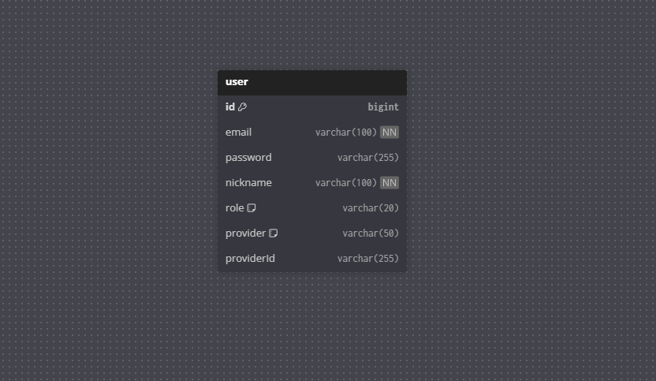
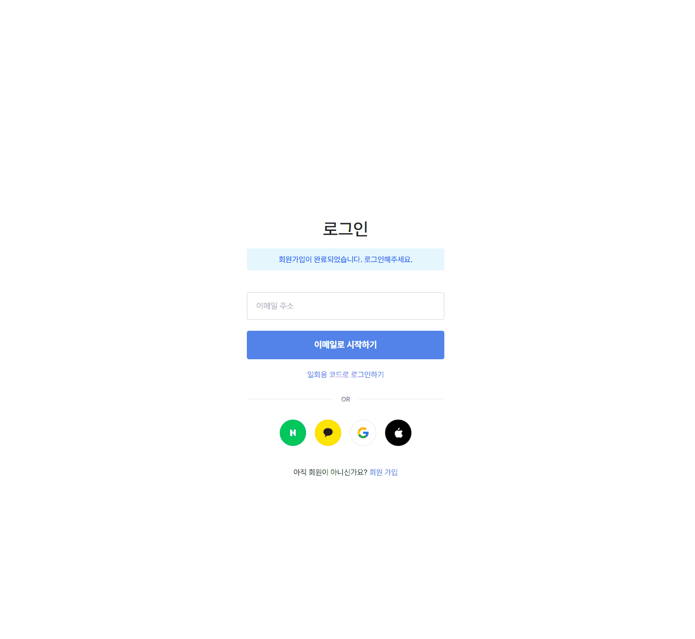

# 🌱 SpringCommunity Project

## ERD (Entity Relationship Diagram)
> 프로젝트의 데이터베이스 구조입니다. 기능별로 나누어 설계되었습니다.

### 1. 사용자 시스템 (User System)
> 회원 가입, 로그인, 권한 관리를 담당하는 핵심 구조입니다.


### 2. 상품 시스템 (Product System)
> 상품 등록, 카테고리 관리, 찜하기 등 중고 거래의 중심이 되는 구조입니다.


### 3. 채팅 시스템 (Chat System)
> 구매자와 판매자 간의 실시간 대화를 위한 1:1 채팅방 구조입니다.


### 4. 주문 및 결제 시스템 (Transaction System)
> 주문 생성부터 PG사 결제 연동까지의 흐름을 관리하는 구조입니다.


<br>

## 📸 주요 기능 시연 (Feature Preview)

### 1. 회원가입 및 이메일 인증 (Sign Up & Email Verification)
> 사용자 본인 확인을 위한 이메일 인증 번호 발송 및 검증 절차를 포함한 안전한 회원가입 프로세스입니다.


### 2. 로그인 (Login)
> Spring Security 기반의 일반 로그인과 Google OAuth 2.0 소셜 로그인을 모두 지원하여 사용자 접근성을 높였습니다.


### 3. 상품 등록 및 조회 (Product Cycle)
> 상품 등록 완료 후 목록 페이지로 자동 이동하며, 등록된 상품의 상세 정보를 즉시 확인할 수 있습니다.


### 4. 실시간 채팅 및 알림 (Chat & Notification)
> WebSocket 기반의 1:1 채팅을 지원하며, 메시지 알림 클릭 시 해당 채팅방으로 이동하여 답변할 수 있습니다.


### 5. 안전 결제 시스템 (Payment)
> PortOne API를 연동하여 실시간 결제를 처리하며, 결제 완료 시 주문 데이터가 자동으로 생성됩니다.


### 6. 관리자 대시보드 (Admin)
> 관리자 페이지에서 메인 배너 순서 및 게시글을 관리할 수 있습니다.


<br>

## 🛠️ 기술 스택 (Tech Stack)
*   **Backend**: Java 17, Spring Boot 3.x, MyBatis, Spring Security (OAuth 2.0)
*   **Frontend**: Thymeleaf, Bootstrap 5, Vue.js (Partial), JavaScript (WebSocket/STOMP)
*   **Database**: MySQL, Redis (Session Store)
*   **External API**: PortOne (Payment), Google Mail (SMTP), Google Cloud (OAuth)

<br>

## 📂 디렉토리 구조 (Directory Structure)
```
src/main/java/com/juwon/springcommunity
├── config          # 설정 파일 (Security, Web, WebSocket, Redis 등)
├── controller      # 컨트롤러 (Web Layer)
├── domain          # 도메인 엔티티 (Model)
├── dto             # 데이터 전송 객체 (DTO)
├── repository      # 데이터 접근 계층 (MyBatis Mapper Interface)
├── service         # 비즈니스 로직 (Service Layer)
└── util            # 유틸리티 클래스
```

<br>

## 🚀 트러블슈팅 (Troubleshooting)

### 1. WebSocket 통신 시 인증 컨텍스트 유실 해결
*   **문제**: HTTP 세션 기반 로그인 상태에서 WebSocket 연결 시, 핸드셰이크 이후 `Principal` 객체가 `null`로 들어와 사용자 식별이 불가능한 문제 발생.
*   **해결**: Spring Security와 STOMP 설정을 연동하여, 소켓 연결(`CONNECT`) 단계에서 유저의 인증 정보를 가로채 `SecurityContext`를 유지하도록 설정함. 이를 통해 채팅 메시지 전송 시 위변조 없는 안전한 사용자 식별을 구현.

### 2. MyBatis N+1 문제 및 조회 성능 최적화
*   **문제**: 채팅방 목록 조회 시, 각 방에 연결된 '상품 정보'와 '상대방 유저 정보'를 가져오기 위해 방 개수만큼 추가 쿼리가 발생하는 N+1 문제 확인.
*   **해결**: MyBatis의 `<resultMap>`과 `<association>` 태그를 활용하여 효율적인 `JOIN` 쿼리를 작성. 단 한 번의 DB 조회로 채팅방, 상품, 구매자, 판매자 정보를 모두 매핑하여 응답 속도를 개선함.

### 3. 결제 데이터 타입 불일치 (UUID 처리)
*   **문제**: PortOne 결제 검증 시, DB의 PK(`Long`)를 예상했으나 주문 번호(`merchant_uid`)가 UUID 문자열로 전달되어 `NumberFormatException` 예외 발생.
*   **해결**: `PaymentService`의 검증 로직을 수정하여, DB PK가 아닌 주문 고유 번호(UUID)를 기준으로 데이터를 조회(`findByOrderUid`)하고 검증하도록 유연하게 변경함.

### 4. 세션 정합성을 위한 Redis 도입
*   **문제**: 기본 메모리 세션 사용 시, 서버 재배포나 스케일 아웃 환경에서 로그인 세션이 초기화되는 불안정성 존재.
*   **해결**: `spring-boot-starter-data-redis`를 도입하여 세션 저장소를 Redis로 외부화함. 이를 통해 서버 재시작 시에도 로그인이 유지되는 안정적인 세션 환경을 구축.

<br>

## ⚙️ 실행 방법 (How to run)

### 1. 레포지토리 클론
```bash
git clone https://github.com/jerkyoon8/jungoTown-project.git
cd jungoTown-project
```

### 2. 필수 설정 파일 생성 (중요!)
보안상 Git에 포함되지 않은 `application-secret.properties` 파일을 생성해야 합니다.
`src/main/resources/application-secret.properties` 경로에 파일을 만들고 아래 내용을 본인의 API 키로 채워주세요.

```properties
# Google Mail Server Secrets (이메일 인증용)
spring.mail.username=your_gmail_address
spring.mail.password=your_app_password

# PortOne (Payment V2)
portone.store.id=your_store_id
portone.api.secret=your_api_secret
```

### 3. 데이터베이스 설정
*   MySQL을 설치하고 `springcommunity_db` 스키마를 생성합니다.
*   `src/main/resources/application.properties`에서 DB 계정(`username`, `password`)을 본인 환경에 맞게 수정합니다.

### 4. 빌드 및 실행
```bash
# Windows
./gradlew.bat bootRun

# Mac/Linux
./gradlew bootRun
```

<br>

## 👨‍💻 프로젝트 정보
*   **개발 기간**: 2025.12.09 ~ 2026.01.05
*   **개발 인원**: 1인 (개인 프로젝트)

